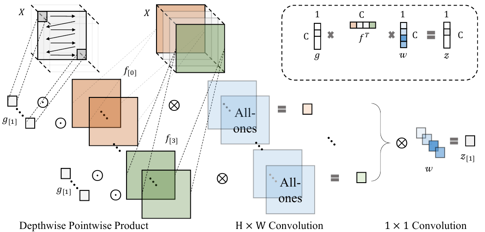
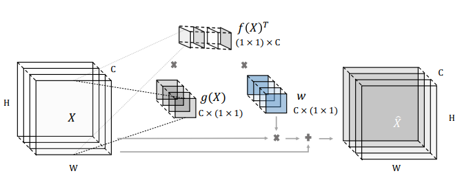
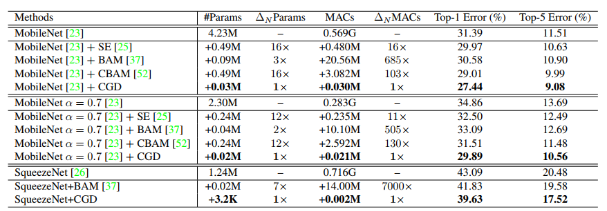
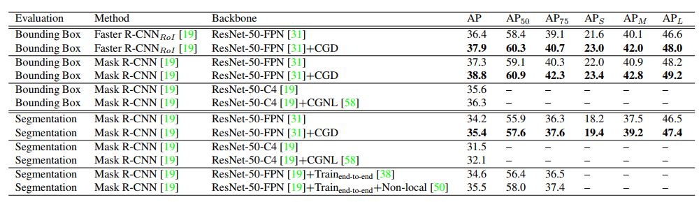
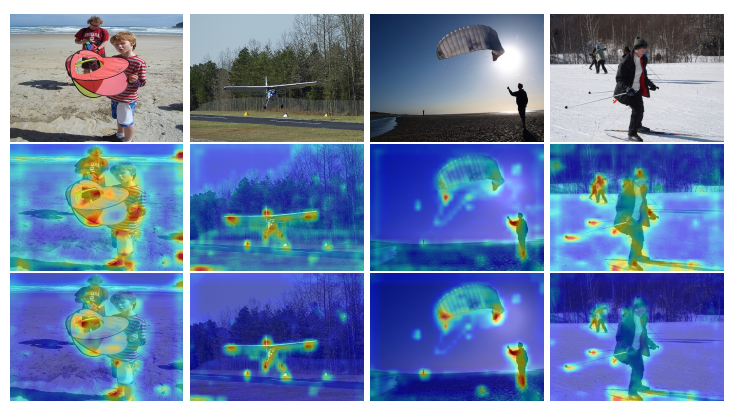

# Compact-Global-Descriptor
The Pytorch implementation of "Compact Global Descriptor for Neural Networks" (CGD). [arXiv](https://arxiv.org/abs/1907.09665)

### Toy illustration :

CGD is a simple yet effective way to capture the correlations between each position and all positions across channels. 

 
and 
 
correspond to the global average pooling which maps features across spatial dimensions into a response vector.



&=X(1+\text{Tanh}(\text{pool}_{ave}(X)\text{pool}_{ave}(X)^Tw))) 

### Final scheme :
The cascaded scheme utlizes both max pooling and ave pooling:

&=\text{Tanh}(\text{Softmax}(\text{pool}_{ave}(X))\text{pool}_{ave}(X)^Tw))

&=\text{Tanh}(\text{Softmax}(\text{pool}_{ave}(X))\text{pool}_{max}(X)^Tw'))

&=X(1+\text{Tanh}(\psi(X)\phi(X)^Tw''))) 

See [attention_best.py](https://github.com/HolmesShuan/Compact-Global-Descriptor/blob/master/attention_best.py) for detail.

### How to use ?
Add an attention layer (CGD) right after the first convolution layer in each block. Set the weight decay of CGD to [4e-5](https://github.com/HolmesShuan/Compact-Global-Descriptor/blob/cb19677522c1c3f3105cac6229ecdc6d432ffb11/classification/imagenet.py#L223).
#### Init :
```python
# __init__(self, in_channels, out_channels, bias=True, nonlinear=True):
self.attention = AttentionLayer(planes, planes, True, True)
```
#### ResNet / MobileNet
```python
out = self.conv1(x)
out = self.attention(out)
out = self.bn1(out)
out = self.relu(out)
```
#### PreResNet
```python
residual = x

out = self.bn1(x)
out = self.relu(out)
out = self.conv1(out)

out = self.attention(out)

out = self.bn2(out)
out = self.relu(out)
out = self.conv2(out)
```
#### SqueezeNet
```python
x = self.squeeze_activation(self.bn(self.attention(self.squeeze(x))))
```
#### WRN
```python
if not self.equalInOut:
    x = self.relu1(self.bn1(x))
else:
    out = self.relu1(self.bn1(x))
out = self.relu2(self.bn2(self.attention(self.conv1(out if self.equalInOut else x))))
```

### Results :
#### ImageNet Acc


#### COCO mAP



### Saliency Map:



We visualize the feature map of res5b branch2a after ReLU. Second row is the original ResNet50 results.
Third row illustrates the results with CGD. CGD deactivates neurons corresponding to backgrounds, which reduces the background noise and helps CNN focus more on objects.

### Cite
```
@article{CGD,
  author    = {Xiangyu He and 
               Ke Cheng and 
               Qiang Chen and
               Qinghao Hu and
               Peisong Wang and
               Jian Cheng},
  title     = {Compact Global Descriptor for Neural Networks},
  journal   = {arXiv},
  volume    = {abs/1907.09665},
  year      = {2019},
  url       = {http://arxiv.org/abs/1907.09665}
}
```
